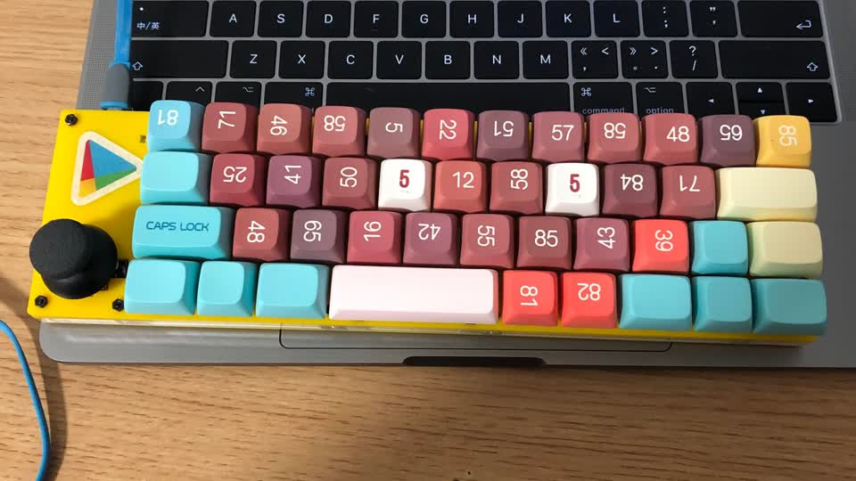

# Enjoy

Extremely borderless mechanical keyboard. 40% staggered layout with an analog joystick, runs [QMK firmware](https://github.com/myst729/qmk_firmware/tree/master/keyboards/dg/enjoy).

Joystick can be used as a mouse . A super cheap alternative to the ThinkPad trackpoint. In gaming mode the whole keyboard is a gamepad.

## Features

- [ ] OLED Driver
- [x] Backlight
- [ ] LED Matrix
- [ ] RGB Lighting
- [ ] RGB Matrix
- [ ] Audio
- [ ] Bluetooth
- [ ] Li-Po Charger
- [ ] Encoders
- [x] Joystick
- [x] LED Indicators
- [ ] RGB Indicators
- [ ] PS/2 Mouse
